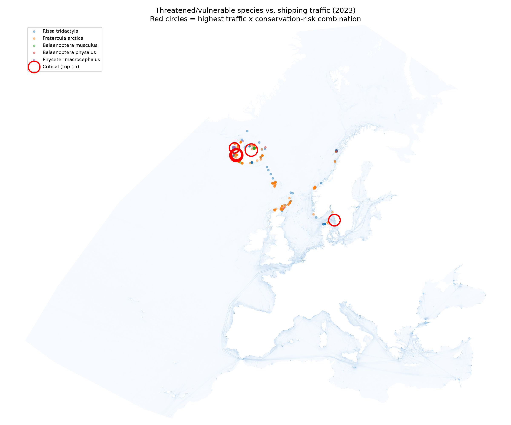
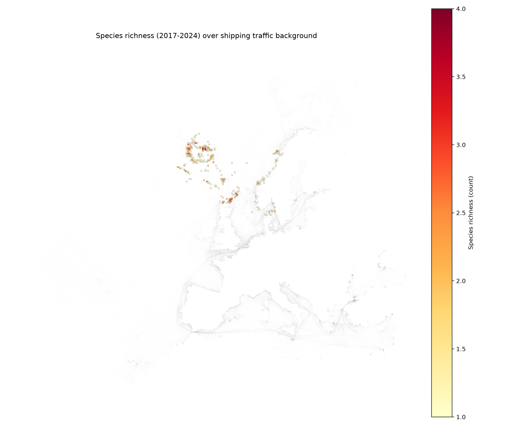
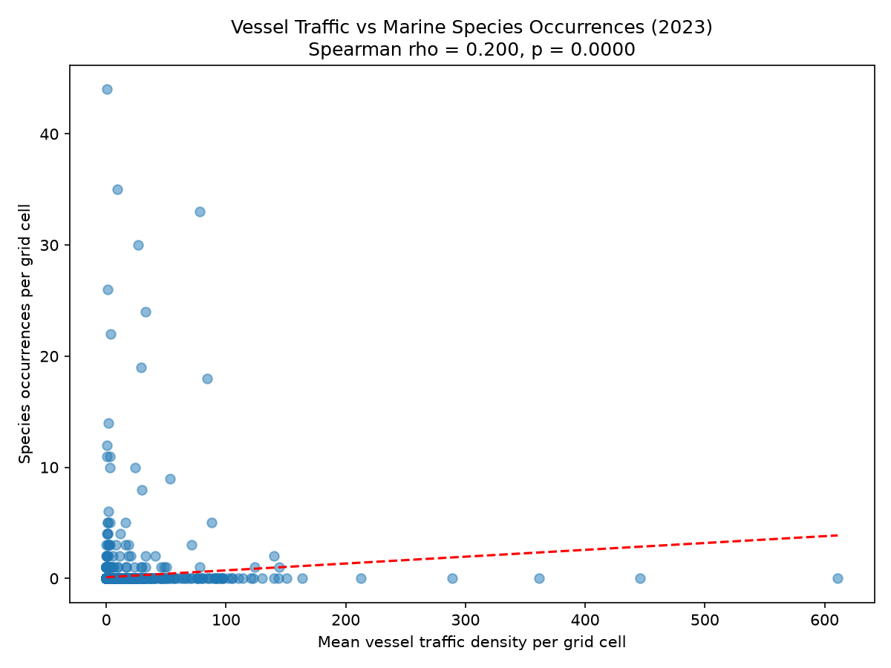
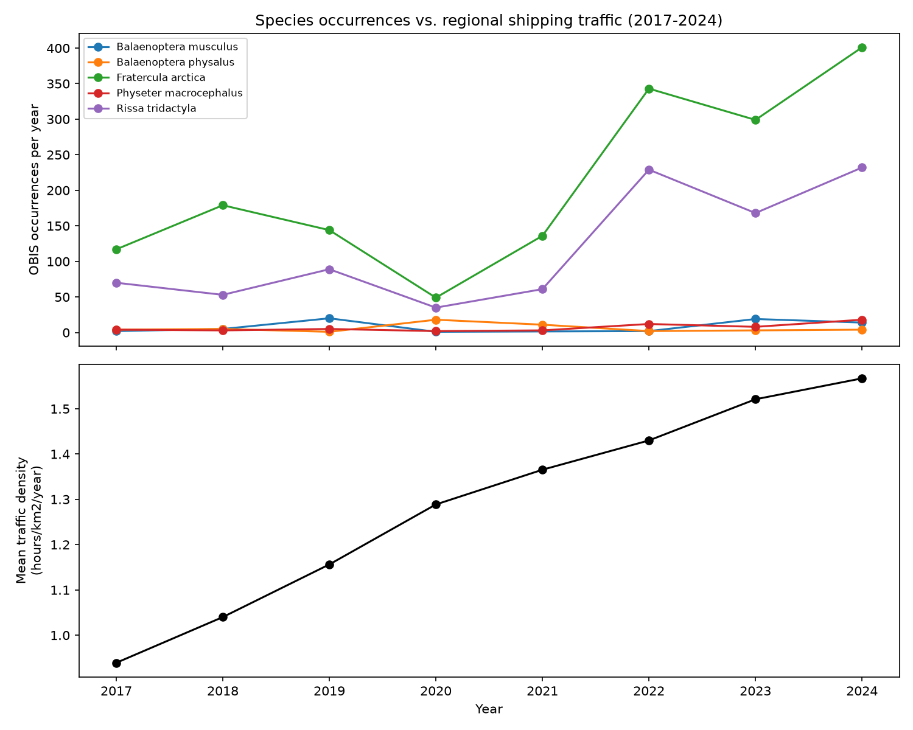
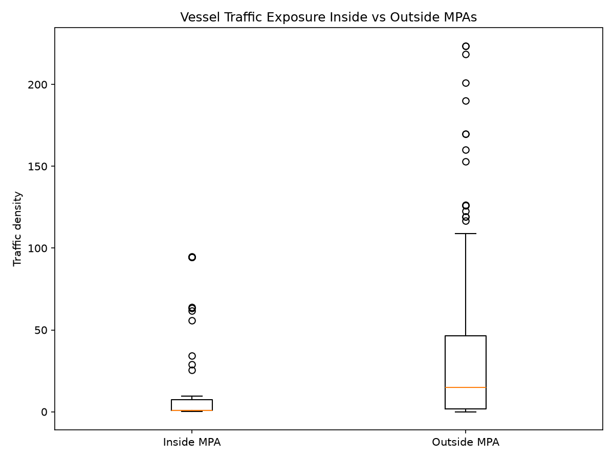

# <h1 align="center">**Vessel Traffic vs Marine Biodiversity (Scandinavia)**</h1>


<p align="justify">Fourth project in my oceanographic data series (short title: Shipping Traffic vs. Marine Biodiversity). This one crosses two very different kinds of ocean data: vessel traffic density rasters (EMODnet, Global Fishing Watch) and species occurrence records (OBIS) for six threatened and vulnerable marine species. The goal was to build a full spatial pipeline — pulling occurrence data, reprojecting and sampling raster values at species locations, running a formal statistical test, and producing a "critical points" map that combines traffic exposure with conservation status.</p>


**Development environment:** Visual Studio Code (VS Code)


**Project status:** _Completed_ — R and Python


## Why This Dataset


<p align="justify">My previous projects worked with a single data type at a time (a time series, a 3D model output). This one is explicitly about crossing two unrelated data types — human activity (shipping) and biology (species occurrence) — over the same geography, which meant handling coordinate reference systems, raster sampling, and spatial joins instead of just tabular aggregation.</p>


<p align="justify">I picked shipping traffic vs. marine biodiversity because it's a real conservation question, not just a technical exercise: does vessel traffic overlap with where threatened species actually are, and does that overlap change over time or fall inside/outside protected areas? The vessel-traffic side of this crossing also draws on ground I'd covered before moving into data science, from an earlier technical background in naval construction.</p>


Questions I tried to answer:


<table align="center">
  <tr>
    <th>Question</th>
    <th>Approach</th>
  </tr>
  <tr>
    <td>How much traffic surrounds each species occurrence?</td>
    <td>Point sample + 10km buffer mean from the EMODnet raster, per occurrence (2023)</td>
  </tr>
  <tr>
    <td>Is there a statistically significant relationship between traffic and species presence?</td>
    <td>Grid-based Spearman correlation, with p-value</td>
  </tr>
  <tr>
    <td>Does fishing-specific effort tell the same story as all-vessel traffic?</td>
    <td>Not answered — see <em>Notes</em> (scoped out: Global Fishing Watch's public dataset was too large to process locally)</td>
  </tr>
  <tr>
    <td>Which areas host the most different species, not just the most sightings?</td>
    <td>Species richness per grid cell (2017-2024)</td>
  </tr>
  <tr>
    <td>How close is each occurrence to the busiest shipping lanes?</td>
    <td>Distance from each point to the nearest top-decile-traffic pixel</td>
  </tr>
  <tr>
    <td>Are occurrences inside Marine Protected Areas less exposed to traffic?</td>
    <td>Inside/outside MPA comparison, Mann-Whitney U test</td>
  </tr>
  <tr>
    <td>Where do the highest-risk overlaps happen?</td>
    <td>Criticality score combining traffic level with IUCN conservation status</td>
  </tr>
</table>


## Dataset


<p align="justify">
This project combines four independent sources rather than one. Traffic and occurrence data come from different institutions, different coordinate systems, and different data models (raster vs. point records), which is most of what made this project harder than a single-source analysis.
</p>


<table align="center">
  <tr>
    <th>Source</th>
    <th>What it provides</th>
  </tr>
  <tr>
    <td><a href="https://obis.org">OBIS</a> (via <code>robis</code>)</td>
    <td>Occurrence records for 6 threatened/vulnerable species, 1900-2026</td>
  </tr>
  <tr>
    <td><a href="https://globalfishingwatch.org/data-download/datasets/public-fishing-effort">Global Fishing Watch — Public Fishing Effort</a></td>
    <td>Apparent fishing effort, 2012-2024, from 190,000+ vessels, pre-aggregated to hours fished per grid cell — evaluated, not used in the final pipeline (too large to process locally without regional pre-filtering; see <em>Notes</em>)</td>
  </tr>
  <tr>
    <td><a href="https://ows.emodnet-humanactivities.eu/geonetwork/srv/api/records/0f2f3ff1-30ef-49e1-96e7-8ca78d58a07c/attachments/EMODnet_HA_Vessel_Density_allAvg.zip">EMODnet Human Activities — Vessel Density (all types, annual average)</a></td>
    <td>Vessel traffic density, all ship types combined, 2017-2024</td>
  </tr>
  <tr>
    <td><a href="https://www.protectedplanet.net">WDPA</a> (World Database on Protected Areas)</td>
    <td>Marine Protected Area boundaries for Norway, Denmark, Iceland</td>
  </tr>
</table>


<p align="justify">Species names and taxonomic groupings follow OBIS's own backbone, which is itself built on the <a href="https://doi.org/10.48580/d4fd">World Register of Marine Species (WoRMS)</a> and, for genus-level resolution, the <a href="https://doi.org/10.15468/6tkudz">Interim Register of Marine and Nonmarine Genera (IRMNG)</a> — the two standard taxonomic authorities behind most marine biodiversity databases. This is what makes the subspecies-to-species merge described below reliable rather than a guess.</p>


<p align="justify">Two temporal cuts of the OBIS data were used, since the traffic sources don't share the same date range: a <strong>2023 spatial cut</strong> (the one year covered by both EMODnet and the Global Fishing Watch file downloaded) and a <strong>2017-2024 temporal cut</strong> (matching EMODnet's full coverage) for the trend analysis.</p>


### Species of interest


<table align="center">
  <tr><th>Species</th><th>Common name</th><th>IUCN status</th></tr>
  <tr><td><i>Balaenoptera musculus</i></td><td>Blue whale</td><td>EN</td></tr>
  <tr><td><i>Balaenoptera physalus</i></td><td>Fin whale</td><td>VU</td></tr>
  <tr><td><i>Physeter macrocephalus</i></td><td>Sperm whale</td><td>VU</td></tr>
  <tr><td><i>Fratercula arctica</i></td><td>Atlantic puffin</td><td>VU</td></tr>
  <tr><td><i>Rissa tridactyla</i></td><td>Black-legged kittiwake</td><td>VU</td></tr>
  <tr><td><i>Dermochelys coriacea</i></td><td>Leatherback turtle</td><td>VU (rare visitor)</td></tr>
</table>


### Study region


<p align="justify">
Southern/central Scandinavia — Norway, Denmark and southern Iceland — capped at <strong>68°N</strong>. The original OBIS query covered up to 82°N to include the full Norwegian coastline, but the EMODnet raster's coverage stops around 68°N, so the study region was restricted to keep traffic and occurrence data comparable. This drops far-northern Norway and Svalbard from the analysis — see Limitations.
</p>


## What I Did


<p align="justify">The pipeline is a sequence of scripts, split between R (data collection) and Python (everything spatial and statistical). All Python scripts share settings — file paths, the raster CRS, species/IUCN lookups — through a single <code>config.py</code>. R is used for exactly one step, since <code>robis</code> (the OBIS client) doesn't have as mature a Python equivalent; everything geospatial and statistical after that runs on Python's more established stack for this kind of work (<code>geopandas</code>, <code>rasterio</code>, <code>scipy</code>).</p>


<table align="center">
  <tr><th align="center">Step</th><th align="center">Script</th><th align="center">Purpose</th></tr>
  <tr><td align="center">R</td><td><code>pull_obis.R</code></td><td align="justify">Pull occurrence records from OBIS for the 6 target species, normalize subspecies names, export the 2023 and 2017-2024 CSVs</td></tr>
  <tr><td align="center">01</td><td><code>filter_region.py</code></td><td align="justify">Filter OBIS points to the raster's actual coverage (≤68°N)</td></tr>
  <tr><td align="center">02</td><td><code>spatial_overlay_2023.py</code></td><td align="justify">Sample EMODnet traffic density at each 2023 occurrence — exact pixel value and 10km buffer mean</td></tr>
  <tr><td align="center">03</td><td><code>temporal_analysis.py</code></td><td align="justify">Sample traffic per year (2017-2024) at that year's occurrences; compute regional traffic trend</td></tr>
  <tr><td align="center">04</td><td><code>critical_points_map.py</code></td><td align="justify">Compute a criticality score (traffic × IUCN weight) and map the top overlaps</td></tr>
  <tr><td align="center">05</td><td><code>statistical_test.py</code></td><td align="justify">Grid-based Spearman correlation between traffic and occurrence count, with p-value</td></tr>
  <tr><td align="center">06</td><td><code>species_richness_map.py</code></td><td align="justify">Map species richness (distinct species count) per grid cell, 2017-2024</td></tr>
  <tr><td align="center">07</td><td><code>distance_to_shipping_lanes.py</code></td><td align="justify">Distance from each occurrence to the nearest top-decile-traffic pixel</td></tr>
  <tr><td align="center">08</td><td><code>mpa_comparison.py</code></td><td align="justify">Flag occurrences inside/outside MPAs (WDPA), compare traffic exposure with a Mann-Whitney U test</td></tr>
</table>


**Coordinate systems**


<p align="justify">
OBIS data comes in EPSG:4326 (lat/lon); the EMODnet raster is in EPSG:3035 (LAEA Europe, meters). Points are reprojected to EPSG:3035 before any raster sampling, since reprojecting a handful of points is far cheaper than reprojecting a multi-gigabyte raster. Before trusting that reprojection anywhere in the pipeline, a quick sanity check confirmed a known coordinate (Reykjavik) lands inside the raster's actual pixel grid, not just inside its bounding box:
</p>


```python
transformer = Transformer.from_crs("EPSG:4326", "EPSG:3035", always_xy=True)
x, y = transformer.transform(-21.94, 64.15)  # Reykjavik, lon/lat
row, col = src.index(x, y)
print(f"row={row}, col={col}, dimensions={src.height}x{src.width}")
```


**Taxonomic normalization**


<p align="justify">
OBIS returns some records at the subspecies level (e.g. <i>Balaenoptera physalus physalus</i>). These were merged into their parent species before any counting, to avoid silently undercounting a species split across two name variants — the same WoRMS-backed taxonomy referenced above is what makes that merge safe.
</p>


**Criticality score**


<p align="justify">
Rather than flagging "critical points" by traffic alone, the score combines normalized traffic (0-1) with each species' IUCN weight (EN = 3, VU = 2), so an endangered species in a busy lane ranks above a vulnerable species at the same traffic level.
</p>


```python
traffic_norm = (traffic - traffic.min()) / (traffic.max() - traffic.min())
weight = df["especie_normalizada"].map(IUCN_STATUS).map(IUCN_WEIGHT)
df["criticality_score"] = traffic_norm * weight
```


**MPA matching**


<p align="justify">
The WDPA download covers all of Europe, split across several shapefiles. <code>mpa_comparison.py</code> scans every shapefile in the extracted folder, filters to Norway/Denmark/Iceland using the <code>ISO3</code> attribute, and caches the merged result as GeoJSON so later runs don't re-process the full European dataset. The filter has to handle transboundary protected sites, where <code>ISO3</code> holds several semicolon-separated country codes in one field instead of a single value:
</p>


```python
def matches(value) -> bool:
    codes = {code.strip() for code in str(value).split(";")}
    return bool(codes & target)


mask = gdf["ISO3"].apply(matches)
```


**Distance to busy shipping lanes**


<p align="justify">
"Busy" is defined as the top 10% of traffic-density pixels in the EMODnet raster for a given year. A Euclidean distance transform then gives, for every pixel in the raster, its distance to the nearest busy pixel — occurrence points are sampled against that surface rather than computed against each busy pixel individually, which would be far slower over a full-resolution raster.
</p>


```python
threshold = np.percentile(data[valid_mask], 90)
busy_mask = valid_mask & (data >= threshold)
distance_pixels = distance_transform_edt(~busy_mask)
distance_meters = distance_pixels * pixel_size_m
```


## Data Quality


<p align="justify">Known data quality issues, checked and documented rather than silently ignored:</p>


<ul>
  <li align="justify">Some pre-1980s <i>Balaenoptera physalus</i> and <i>Rissa tridactyla</i> records in OBIS are tagged with the generic <code>"Occurrence"</code> basis of record rather than <code>"HumanObservation"</code> — these may include historical whaling catch data rather than live sightings, and were not used for any historical narrative in this project.</li>
  <li align="justify">After the 68°N filter, <i>Balaenoptera physalus</i> (n=3) and <i>Physeter macrocephalus</i> (n=8) have very few records in the 2023 spatial cut — results for these two species in that specific analysis are qualitative only.</li>
  <li align="justify"><i>Dermochelys coriacea</i> has zero records in the 2023 cut and is excluded from the spatial analysis, kept only in the 2017-2024 temporal view.</li>
</ul>


<p align="center"><strong>Occurrence counts by species (after 68°N filter)</strong></p>


<table align="center">
  <tr><th>Species</th><th>2023 (spatial)</th><th>2017-2024 (temporal)</th></tr>
  <tr><td><i>Fratercula arctica</i></td><td>299</td><td>1,668</td></tr>
  <tr><td><i>Rissa tridactyla</i></td><td>168</td><td>937</td></tr>
  <tr><td><i>Balaenoptera musculus</i></td><td>19</td><td>63</td></tr>
  <tr><td><i>Physeter macrocephalus</i></td><td>8</td><td>55</td></tr>
  <tr><td><i>Balaenoptera physalus</i></td><td>3</td><td>48</td></tr>
  <tr><td><i>Dermochelys coriacea</i></td><td>0</td><td>0</td></tr>
</table>


## Results


<p align="justify">
The grid-based Spearman correlation between traffic and occurrence count came back <strong>rho = 0.200, p &lt; 0.0001</strong> (n = 3,771 grid cells, 25km resolution) — a statistically significant but <strong>weak</strong> positive relationship. Only 100 of those cells actually contained any occurrence, so the significance is driven largely by sample size rather than a strong effect: traffic explains only a small part of where occurrences were recorded, consistent with the observation-effort caveat discussed below.
</p>


<p align="justify">
Regional mean traffic density rose steadily across the study period, from <strong>0.94 (2017) to 1.57 hours/km²/year (2024)</strong> — a 67% increase. Occurrence counts didn't track that trend cleanly: <i>Fratercula arctica</i> and <i>Rissa tridactyla</i> both dropped sharply in 2020 (likely reduced field observation during the pandemic, not a real population crash) before rising well above their pre-2020 levels by 2022-2024. The three cetacean species stayed low and noisy throughout, without a clear trend in either direction.
</p>


<p align="justify">
None of the 15 highest-scoring "critical points" involved a whale species, despite <i>Balaenoptera musculus</i> (Endangered, the highest IUCN weight in the list) being present in the dataset — the critical list is entirely <i>Fratercula arctica</i> (8 points) and <i>Rissa tridactyla</i> (7 points), both Vulnerable. This is because the criticality score is traffic-weighted: the whales in this dataset simply don't occur in the highest-traffic pixels, while these two seabird species do. It's a useful illustration of why the score combines both factors rather than ranking by conservation status alone.
</p>


<p align="justify">
Species richness across the 2017-2024 dataset topped out at <strong>4 species in a single 25km cell</strong> (2 cells reached that), with 21 cells hosting 3 species and 77 hosting 2 — the large majority of occupied cells (166 of 266) had only 1 species recorded, meaning multi-species hotspots are the exception rather than the rule in this region.
</p>


<p align="justify">
Distance to the nearest busy shipping lane (top 10% traffic pixels) was under 1km at the median for every species — most occurrences happen very close to a busy lane even when the point itself isn't in one. <i>Rissa tridactyla</i> had the highest mean distance (3.6km) and widest spread, while <i>Balaenoptera musculus</i> and <i>Physeter macrocephalus</i> stayed closest on average (~0.4-0.5km) despite their small sample sizes.
</p>


<p align="justify">
The MPA comparison gives the cleanest result in the whole project. Of 490 occurrences with a valid traffic value, <strong>25.4% fall inside a Marine Protected Area</strong>. Mean traffic exposure inside MPAs is <strong>10.4</strong>, against <strong>27.5</strong> outside — under half — and the median tells an even sharper story (<strong>0.97</strong> inside vs. <strong>14.9</strong> outside). A Mann-Whitney U test confirms this isn't noise: <strong>U = 13,474, p ≈ 3.5×10⁻¹¹</strong>. For this region, MPA designation is doing what it's supposed to do — occurrences inside protected boundaries are genuinely exposed to much less shipping traffic than occurrences outside them.
</p>


<p align="justify">
<strong>Global Fishing Watch integration was scoped out.</strong> The public GFW fishing-effort dataset covers 2012-2024 across 190,000+ vessels; without pre-filtering by year and region before download, the file is large enough that even an efficient nearest-neighbours lookup (<code>scipy.spatial.cKDTree</code>) becomes impractical to run locally. <code>gfw_integration.py</code> was rewritten once to read the file properly (the original version silently contained a duplicate of the shipping-lane-distance logic instead of real GFW code), but the dataset's size made it not worth pursuing further for this version of the project — the five analyses above don't depend on it.
</p>


## Visualisations


**Critical points map**


<p align="justify">
The 15 highest-scoring critical points cluster almost entirely around two places: the waters off <strong>Reykjavik, Iceland</strong> (13 of the 15 points, both species) and the <strong>Kattegat strait</strong> between Denmark and Sweden (2 points) — both high-traffic corridors where <i>Fratercula arctica</i> (8 points) and <i>Rissa tridactyla</i> (7 points) occurrences overlap the busiest shipping. No whale species make the top 15, despite <i>Balaenoptera musculus</i> carrying the highest IUCN weight in the list — see <em>Results</em> for why.
</p>


<p align="center">
  
</p>


**Species richness**


<p align="justify">
Richness hotspots concentrate almost entirely around <strong>Iceland's southwest coast</strong>, with a secondary band running along the <strong>Norwegian coastline</strong> — the same two regions that dominate the critical points map above. The two cells that reach the maximum of 4 species sit right off Reykjavik, the same corridor flagged as highest-traffic. Most of the study region, including the open water further from these coastlines, shows no recorded overlap at all — richness is concentrated, not spread out.
</p>


<p align="center">
  
</p>


**Traffic vs. occurrences (statistical test)**


<p align="center">
  
</p>


**Temporal trend (2017-2024)**


<p align="center">
  
</p>


**Traffic inside vs. outside MPAs**


<p align="center">
  
</p>


## Output Files


<table align="center">
  <tr><th align="center">File</th><th align="center">Description</th></tr>
  <tr><td align="center"><code>spatial_overlay_2023.csv</code></td><td align="center">2023 occurrences with traffic values (point + buffer mean)</td></tr>
  <tr><td align="center"><code>spatial_overlay_2023_with_distance.csv</code></td><td align="center">Same, plus distance to nearest busy lane</td></tr>
  <tr><td align="center"><code>spatial_overlay_2023_with_mpa.csv</code></td><td align="center">Same, plus inside/outside MPA flag</td></tr>
  <tr><td align="center"><code>temporal_species_by_year.csv</code></td><td align="center">Occurrence count + mean traffic at points, per species per year</td></tr>
  <tr><td align="center"><code>temporal_regional_traffic.csv</code></td><td align="center">Regional mean traffic per year</td></tr>
  <tr><td align="center"><code>grid_traffic_vs_occurrences.csv</code></td><td align="center">Grid cell stats used in the Spearman test</td></tr>
  <tr><td align="center"><code>species_richness_grid.csv</code></td><td align="center">Species richness per grid cell</td></tr>
  <tr><td align="center"><code>critical_points.csv</code></td><td align="center">Top-scoring critical points (traffic × IUCN weight)</td></tr>
</table>


## Notes


<p align="justify">
It's worth being upfront about why this crossing matters, and where it's limited.
</p>


<p align="justify">
<strong>Shipping and marine megafauna.</strong> Ship strikes are a documented, significant cause of mortality for large whales in busy waters worldwide, and underwater noise from vessel traffic is increasingly recognized as a chronic stressor affecting communication, foraging and stress levels in cetaceans — sperm whales and fin whales, both represented in this dataset, are among the species most frequently reported as ship-strike victims in the North Atlantic. Seabirds like the Atlantic puffin and kittiwake face different but related pressures — disturbance, pollution and prey depletion linked to intensive fishing and shipping activity in their feeding range; both species are already in decline across parts of the North Atlantic, which is part of why they carry a Vulnerable IUCN status despite still being common enough to dominate this dataset's occurrence counts. Mapping where threatened species overlap with the busiest traffic isn't just descriptive: it's the kind of evidence used to justify seasonal speed restrictions, rerouting, or expanding protected areas — real interventions already in use in places like the Roseway Basin and Gulf of St. Lawrence for North Atlantic right whales.
</p>


<p align="justify">
<strong>Why the MPA comparison matters.</strong> A Marine Protected Area only reduces a species' exposure to shipping if it actually reduces traffic inside its boundary — MPA designation doesn't automatically restrict vessel movement, and plenty of MPAs worldwide have documented traffic passing straight through them. The inside/outside comparison confirmed above is a direct, data-driven way to check whether that protection is functioning as intended for this region, rather than assuming it from the map alone.
</p>


<p align="justify">
<strong>Why this is worth being careful about.</strong> OBIS occurrence counts reflect where people recorded a sighting, not necessarily where a species truly spends the most time — more records near busy coastal areas can just mean more observers, not more animals. This project treats occurrence density as a proxy, not a direct abundance measure, and the statistical test and MPA comparison should be read with that caveat in mind rather than as proof of a causal traffic effect.
</p>


<p align="justify">
<strong>On the Global Fishing Watch dataset.</strong> It was set aside for practical reasons (see <em>Results</em>), not for lack of relevance — apparent fishing effort captures a specific subset of maritime activity that all-vessel traffic density doesn't distinguish, and it would be a natural extension of this project if revisited with a pre-filtered regional download instead of the full global file.
</p>


<p align="justify">
This project also has real scope limits: the EMODnet raster's ~68°N cutoff excludes part of the Norwegian coastline and Svalbard from the traffic-crossed analyses (they're still present in the raw OBIS pull), only one full year (2023) has confirmed overlap between all three traffic-related sources, and species-level sample sizes vary a lot — from over a hundred thousand OBIS records (kittiwake, puffin) down to a few dozen (blue whale, leatherback turtle) in the filtered region.
</p>


## Tools


**Programming and Development**
- Python
- R
- Visual Studio Code (VS Code)


**Python Libraries**
- GeoPandas
- Rasterio
- Shapely
- PyProj
- SciPy
- Pandas
- NumPy
- Matplotlib


**R Libraries**
- robis
- sf
- dplyr


**Data Formats**
- CSV
- GeoJSON
- GeoTIFF
- Shapefile


## Skills Demonstrated


<p align="center"><i>Python - R - Geospatial Analysis - Raster Processing - Coordinate Reference Systems - Spatial Joins - Statistical Testing - Data Integration - Multi-source Data Pipelines - Data Visualisation - Conservation Data Analysis - Oceanographic Data</i></p>


## Bibliography


- [OBIS — Ocean Biodiversity Information System](https://obis.org)
- [Global Fishing Watch — Public Fishing Effort Dataset](https://globalfishingwatch.org/data-download/datasets/public-fishing-effort)
- [EMODnet Human Activities — portal](https://emodnet.ec.europa.eu/en/human-activities)
- [Protected Planet — World Database on Protected Areas (WDPA)](https://www.protectedplanet.net)
- [IUCN Red List of Threatened Species](https://www.iucnredlist.org)
- WoRMS Editorial Board. (2026). [World Register of Marine Species](https://doi.org/10.48580/d4fd) (S. Ahyong, C. Boyko, J. Bernot, S. Brandão, M. Daly, S. De Grave, N. de Voogd, S. Gofas, F. Hernandez, J. Mees, T. A. Neubauer, G. Paulay, & S. van der Meij, Eds.; Version 2026-08-01).
- Rees, T. (compiler) (2025). [The Interim Register of Marine and Nonmarine Genera](https://doi.org/10.15468/6tkudz). Available at irmng.org at VLIZ.


## Author


### Mariana Gomes de Andrade Silva


<p align="center"><strong>Interests: Oceanography - Scientific Programming - Data Analysis - Environmental Data</strong></p>


